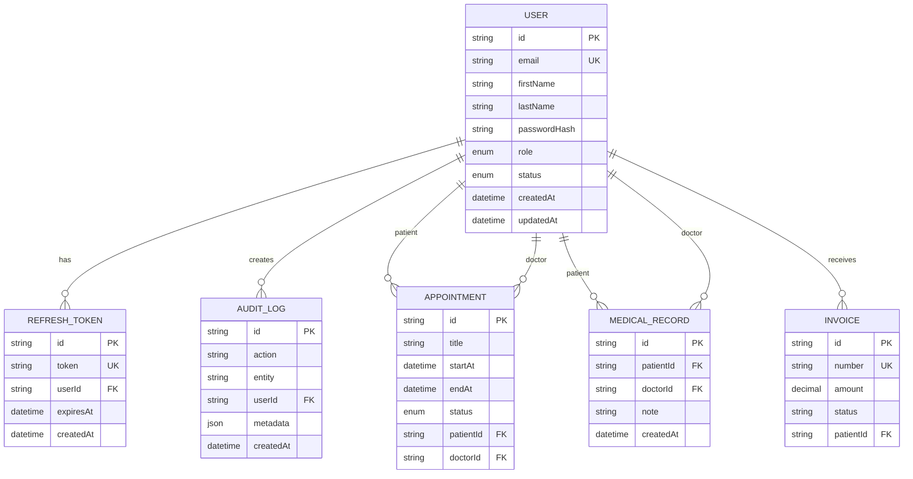

# ER Diagram

```mermaid
erDiagram
    USER ||--o{ REFRESH_TOKEN : has
    USER ||--o{ AUDIT_LOG : creates
    USER ||--o{ APPOINTMENT : patient
    USER ||--o{ APPOINTMENT : doctor
    USER ||--o{ MEDICAL_RECORD : patient
    USER ||--o{ MEDICAL_RECORD : doctor
    USER ||--o{ INVOICE : receives

    USER {
        string id PK
        string email UK
        string firstName
        string lastName
        string passwordHash
        enum role
        enum status
        datetime createdAt
        datetime updatedAt
    }

    REFRESH_TOKEN {
        string id PK
        string token UK
        string userId FK
        datetime expiresAt
        datetime createdAt
    }

    AUDIT_LOG {
        string id PK
        string action
        string entity
        string userId FK
        json metadata
        datetime createdAt
    }

    APPOINTMENT {
        string id PK
        string title
        datetime startAt
        datetime endAt
        enum status
        string patientId FK
        string doctorId FK
    }

    MEDICAL_RECORD {
        string id PK
        string patientId FK
        string doctorId FK
        string note
        datetime createdAt
    }

    INVOICE {
        string id PK
        string number UK
        decimal amount
        string status
        string patientId FK
    }
```

This diagram reflects the centralized schema that powers the foundation. Module-specific entities can be layered in later after requirement confirmation.
